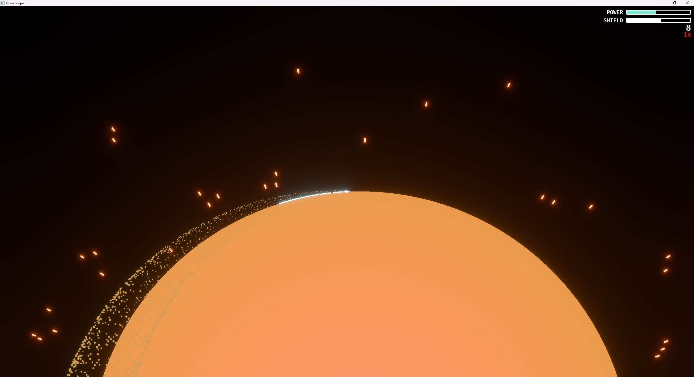

# Nova Looper

A game made in about three days for the GMTK 2025 Game Jam.

The theme was "looper". My intention was to make a really simple game and then
spend a bit of time polishing and working with shaders and particles to make
it a bit more interesting visually (I'm not sure I got there, but I tried!)

Its a very simple game, press `spacebar`, tap the screen or click the left
mouse button to pilot the ship around the sun collecting energy. Don't fly too
close for too long or you'll burn up!

Available at <https://wilsk.itch.io/nova-looper>.

